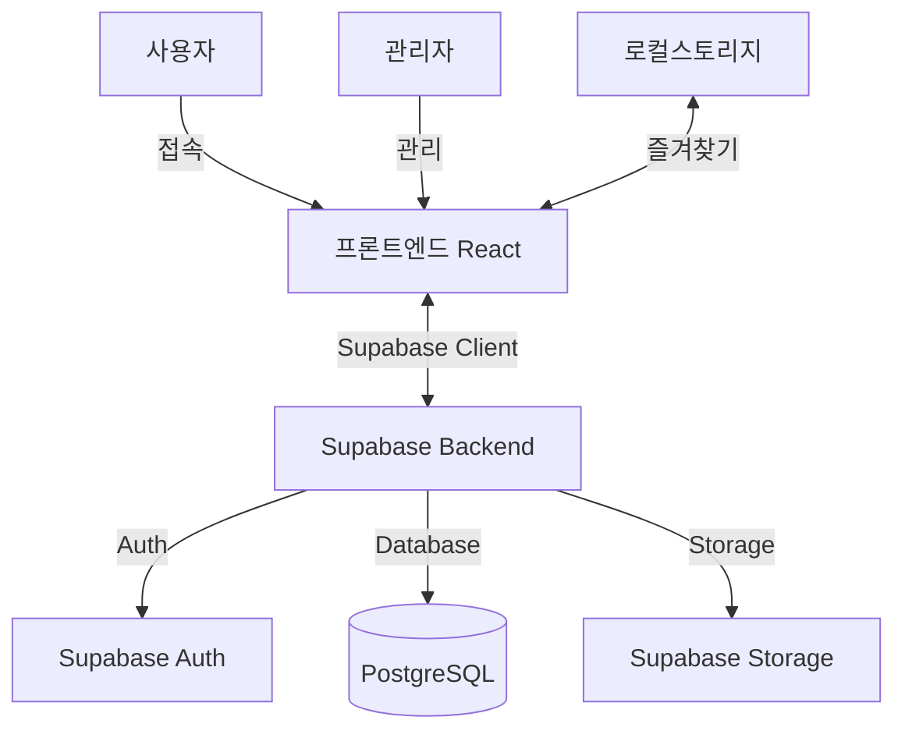

# 1. 배경과 목적

- 이 웹 애플리케이션은 관리자가 환상적인 아티스트와 노래를 수동으로 추가하고 공개 및 공유할 수 있는 웹사이트를 제공합니다.
- 대상 사용자는 새로운 음악과의 만남을 요구하는 음악 팬입니다.

## 시스템 아키텍처



---

# 2. 기능 요구사항

## 2.1 관리 화면 로그인 기능
- **기능 개요**: 관리자가 Supabase Auth를 통해 관리 화면에 로그인합니다.
- **인증 방식**: 이메일/비밀번호 또는 매직 링크 로그인

## 2.2 아티스트 추가 기능
- **기능 개요**: 관리자가 아티스트 이름, 프로필, 이미지 등을 수동으로 추가합니다.
- **이미지 저장**: Supabase Storage의 `artist-images` 버킷에 업로드

## 2.3 아티스트 편집 기능
- **기능 개요**: 관리자가 기존 아티스트 정보를 편집합니다.

## 2.4 곡 추가 기능
- **기능 개요**: 관리자가 아티스트에 곡을 수동으로 추가합니다.
- **파일 저장**: 
  - 곡 이미지: `song-images` 버킷
  - 음성 파일: `audio-files` 버킷

## 2.5 곡 편집 기능
- **기능 개요**: 관리자가 기존 곡 정보를 편집합니다.

## 2.6 곡 재생 기능
- **기능 개요**: 사용자가 공개된 곡을 재생하고 기본적인 음악 플레이어 기능을 제공합니다.
- **재생 위젯**: 관리 화면 이외의 모든 페이지에서 항상 표시되며 재생 상태를 유지합니다.

## 2.7 즐겨찾기 기능
- **기능 개요**: 사용자가 곡을 즐겨찾기에 추가하고 브라우저의 로컬 스토리지에 저장합니다. 데이터베이스에는 저장하지 않습니다.
- **상세**: 즐겨찾기 모듈을 사용하여 즐겨찾기의 추가, 삭제, 조회를 수행합니다. `localStorage`를 이용하여 곡 ID를 저장합니다.

## 2.8 사용자 작업에 대한 피드백
- **기능 개요**: 사용자 작업에 따라 적절한 피드백을 제공합니다.
- **구현**: Toast 알림 사용 (shadcn/ui toast 컴포넌트)

---

# 3. 비기능 요구사항

- **지원하는 디바이스**: PC만 지원 (최신 데스크톱 웹 브라우저)
- **로그인 기능**: 일반 사용자 로그인 기능은 필요 없음 (관리자만 로그인)
- **UI 디자인**: 
  - **21st.dev Magic MCP**를 활용한 AI 기반 UI 컴포넌트 생성
  - **shadcn/ui** 컴포넌트 라이브러리 사용
  - **Tailwind CSS**를 사용하고, CSS 스타일은 직접 작성하지 않음
  - 색상, 글꼴, 버튼 스타일 통일
  - 시각적 계층 구조 명확화
- **접근성 요구사항**: 키보드 조작 대응
- **파일 업로드 처리**: Supabase Storage 사용
  - 버킷 구조:
    - `artist-images`: 아티스트 이미지
    - `song-images`: 곡 앨범 아트
    - `audio-files`: 음성 파일
- **상태 관리**: 
  - React Context API 또는 Zustand 사용
  - 서버 상태: React Query (TanStack Query) 사용

---

# 4. 제약 사항

- **프론트엔드**: HTML5, CSS3, TypeScript, React 18+, Vite
- **백엔드**: Supabase (Database, Auth, Storage)
- **UI 개발 도구**: 21st.dev Magic MCP (AI 기반 컴포넌트 생성)
- **UI 라이브러리**: shadcn/ui + Tailwind CSS
- **라우팅**: React Router v6
- **데이터 페칭**: React Query (TanStack Query)
- **폼 처리**: React Hook Form + Zod
- **개발 환경**: 로컬 개발, Supabase 클라우드 연동
- **보안 대책**: 
  - Supabase Row Level Security (RLS) 정책 적용
  - 관리자 권한은 Supabase Auth의 user metadata로 관리
  - 본 애플리케이션은 교육용 샘플이므로, 기본적인 보안 대책만 적용
- **데이터베이스 사양**: 
  - 이미지나 음성 파일은 Supabase Storage URL을 데이터베이스에 저장
  - PostgreSQL 사용 (Supabase 제공)

---

# 5. 유스 케이스

## 5.1 관리자가 관리 화면에 로그인하고 새로운 아티스트를 추가하는 기능
- **작업 절차**:
  1. 이메일과 비밀번호를 입력하고 로그인 버튼을 클릭
  2. Supabase Auth로 인증
  3. 관리 대시보드에서 "아티스트 추가" 버튼을 클릭
  4. 아티스트 정보와 이미지를 입력하고 "저장" 버튼을 클릭
  5. Supabase Storage에 이미지 업로드 후 URL을 데이터베이스에 저장
- **피드백**:
  - 로그인 실패 시 에러 메시지를 Toast로 표시
  - 저장 성공 시 "아티스트가 추가되었습니다" Toast 표시

## 5.2 관리자가 기존 아티스트에 새로운 곡을 추가하는 기능
- **작업 절차**:
  1. 관리 대시보드에서 대상 아티스트를 선택
  2. "곡 추가" 버튼을 클릭
  3. 곡 정보, 이미지, 음성 파일을 입력하고 "저장" 버튼을 클릭
  4. Supabase Storage에 파일 업로드
- **피드백**:
  - 입력 오류 시 에러 메시지를 Toast로 표시
  - 저장 성공 시 "곡이 추가되었습니다" Toast 표시

## 5.3 관리자가 기존 아티스트나 곡을 편집하는 기능
- **작업 절차**:
  1. 아티스트 또는 곡 목록에서 대상을 선택
  2. "편집" 버튼을 클릭
  3. 정보를 업데이트하고 "저장" 버튼을 클릭
- **피드백**:
  - 업데이트 성공 시 "정보가 업데이트되었습니다" Toast 표시

## 5.4 사용자가 웹사이트에서 새로운 음악을 발견하고 곡을 재생하는 기능
- **작업 절차**:
  1. 홈페이지에서 관심 있는 곡의 "재생" 버튼을 클릭
  2. 재생 위젯에서 재생 및 일시정지를 수행
- **피드백**:
  - 재생 시작 시 재생 위젯에 곡 정보를 표시
  - 페이지 전환 후에도 재생이 계속되며 위젯이 표시

## 5.5 사용자가 마음에 드는 곡을 즐겨찾기에 추가하고 나중에 재생하는 기능
- **작업 절차**:
  1. 곡의 "즐겨찾기에 추가" 버튼을 클릭
  2. 즐겨찾기 페이지에서 곡을 선택하고 재생 버튼을 클릭
- **피드백**:
  - 추가 성공 시 "즐겨찾기에 추가되었습니다" Toast 표시
  - 즐겨찾기에서 곡을 삭제할 때 확인 Dialog 표시

---

# 6. 필요한 페이지 목록 (공통 요소 포함)

## 6.0 공통 요소

### 6.0.1 헤더 (Header 컴포넌트)
- **개요**: 모든 페이지에 표시되는 헤더
- **UI 컴포넌트**:
  - 로고 (🚀 이모지, 클릭하면 홈페이지로 이동)
  - 글로벌 내비게이션 메뉴 (홈, 즐겨찾기 링크)
  - 관리자 로그인 상태 표시 (로그인 시)

### 6.0.2 재생 위젯 (PlayerWidget 컴포넌트)
- **개요**: 사용자가 곡을 재생·일시정지할 수 있는 위젯. 재생 상태, 곡 정보, 재생 시간, 음량을 관리하고 사용자에게 시각적인 피드백을 제공합니다.
- **상태 관리**: Context API 또는 Zustand로 전역 상태 관리
- **디자인**:
  - 전체 레이아웃:
    - 화면 하단에 고정 (`fixed bottom-0`)
    - 전체 너비, 다크 그레이 배경 (`bg-gray-800`)
    - 패딩된 콘텐츠 (`p-4`)를 플렉스 레이아웃으로 배치
  - 곡 정보 (왼쪽):
    - 16x16픽셀의 앨범 아트 이미지
    - 곡 제목과 아티스트 이름 표시
  - 재생 컨트롤 (중앙):
    - shadcn/ui Button 컴포넌트 사용
    - 재생/일시정지 아이콘 (lucide-react)
  - 진행 바:
    - shadcn/ui Slider 컴포넌트 사용
    - 시간 표시: "M:SS / M:SS" 형식
  - 음량 조절 (오른쪽):
    - shadcn/ui Slider 컴포넌트 사용
- **UI 컴포넌트**:
  - 곡명, 아티스트명, 앨범 아트 표시
  - 재생/일시정지 버튼
  - 재생 진행 바와 시간 표시
  - 음량 조절 슬라이더
  - HTML5 Audio API 사용

### 6.0.3 아티스트 카드 (ArtistCard 컴포넌트)
- **개요**: 아티스트 정보를 표시하는 카드
- **Props**:
  - `artist`: Artist 타입 객체
- **UI 컴포넌트**:
  - shadcn/ui Card 컴포넌트 기반
  - 아티스트 이미지 (Supabase Storage URL)
  - 아티스트명
  - 프로필 설명
  - React Router Link로 상세 페이지 이동

### 6.0.4 곡 카드 (SongCard 컴포넌트)
- **개요**: 곡 정보를 표시하는 카드
- **Props**:
  - `song`: SongWithArtist 타입 객체
- **UI 컴포넌트**:
  - shadcn/ui Card 컴포넌트 기반
  - 앨범 아트 (Supabase Storage URL)
  - 곡명, 아티스트명
  - 재생 버튼 (shadcn/ui Button)
  - 즐겨찾기 버튼 (lucide-react Heart 아이콘)
  - 상태: 재생 중 여부, 즐겨찾기 여부

## 6.1 사용자 페이지

### 6.1.1 홈페이지 (/)
- **개요**: 곡과 아티스트를 표시합니다.
- **라우트**: `/`
- **공통 UI 요소**:
  - Header
  - PlayerWidget
- **주요 UI 컴포넌트**:
  - ArtistCard 그리드 레이아웃
  - SongCard 그리드 레이아웃
- **데이터 페칭**: 
  - React Query로 Supabase에서 artists와 songs 조회
  - `useQuery(['artists'])`, `useQuery(['songs'])`

### 6.1.2 아티스트 상세 페이지 (/artists/:id)
- **개요**: 아티스트 정보와 곡 목록을 표시하고 재생할 수 있습니다.
- **라우트**: `/artists/:id`
- **공통 UI 요소**:
  - Header
  - PlayerWidget
- **주요 UI 컴포넌트**:
  - 아티스트 정보 섹션
    - 이미지, 이름, 프로필
  - 곡 목록 (SongCard 사용)
- **데이터 페칭**:
  - `useQuery(['artist', id])` - 아티스트 정보
  - `useQuery(['songs', { artistId: id }])` - 해당 아티스트의 곡 목록

### 6.1.3 즐겨찾기 페이지 (/favorite)
- **개요**: 사용자의 즐겨찾기 곡을 표시하고 관리·재생할 수 있습니다.
- **라우트**: `/favorite`
- **공통 UI 요소**:
  - Header
  - PlayerWidget
- **주요 UI 컴포넌트**:
  - 즐겨찾기 곡 목록 (SongCard 사용)
  - 삭제 버튼 (shadcn/ui Button + AlertDialog)
- **데이터 관리**:
  - localStorage에서 즐겨찾기 ID 목록 조회
  - React Query로 해당 곡들의 상세 정보 페칭

## 6.2 관리자 페이지

### 6.2.1 관리자 로그인 페이지 (/admin/login)
- **개요**: 관리자가 Supabase Auth를 통해 로그인합니다.
- **라우트**: `/admin/login`
- **공통 UI 요소**:
  - Header (로고만)
- **주요 UI 컴포넌트**:
  - shadcn/ui Form + Input 컴포넌트
  - 이메일 입력 필드
  - 비밀번호 입력 필드
  - 로그인 버튼 (shadcn/ui Button)
  - 에러 메시지 표시 (Toast)
- **인증 처리**:
  - Supabase Auth `signInWithPassword`
  - 로그인 성공 시 `/admin/artists`로 리다이렉트

### 6.2.2 관리자 대시보드 (/admin)
- **개요**: 아티스트와 곡 데이터를 관리할 수 있는 관리자 페이지
- **라우트**: `/admin` → `/admin/artists`로 리다이렉트
- **인증 가드**: Supabase Auth 세션 확인, 비로그인 시 로그인 페이지로 리다이렉트

#### 아티스트 관리 페이지 (/admin/artists)
- **개요**: 아티스트 목록 표시, 추가, 편집을 수행합니다.
- **라우트**: `/admin/artists`
- **Supabase 테이블**: `artists`
- **UI 컴포넌트**:
  - shadcn/ui Table 컴포넌트
    - 아티스트명
    - 등록일
    - 곡 관리 링크 (React Router Link)
    - 편집 버튼
  - "신규 아티스트 추가" 버튼
  - shadcn/ui Dialog (모달)
    - React Hook Form + Zod 검증
    - 아티스트명 Input
    - 프로필 Textarea
    - 이미지 파일 업로드 Input
- **데이터 처리**:
  - React Query `useQuery` - 아티스트 목록 조회
  - React Query `useMutation` - 아티스트 추가/수정
  - Supabase Storage - 이미지 업로드

#### 곡 관리 페이지 (/admin/artists/:id/songs)
- **개요**: 특정 아티스트의 곡 목록 표시 및 관리를 수행합니다.
- **라우트**: `/admin/artists/:id/songs`
- **Supabase 테이블**: `songs`
- **UI 컴포넌트**:
  - shadcn/ui Table 컴포넌트
    - 곡명
    - 아티스트명
    - 음성 파일명
    - 편집 버튼
  - "신규 곡 추가" 버튼
  - shadcn/ui Dialog (모달)
    - React Hook Form + Zod 검증
    - 곡명 Input
    - 아티스트 Select (해당 아티스트로 고정 또는 선택 가능)
    - 음성 파일 업로드 Input (mp3, wav 등)
    - 곡 이미지 업로드 Input
- **데이터 처리**:
  - React Query `useQuery` - 곡 목록 조회
  - React Query `useMutation` - 곡 추가/수정
  - Supabase Storage - 이미지 및 음성 파일 업로드

---

# 7. 데이터베이스 스키마 (Supabase PostgreSQL)

## 7.1 artists 테이블
```sql
CREATE TABLE artists (
  id UUID PRIMARY KEY DEFAULT uuid_generate_v4(),
  name TEXT NOT NULL,
  profile TEXT,
  image_url TEXT,  -- Supabase Storage URL
  created_at TIMESTAMP WITH TIME ZONE DEFAULT NOW(),
  updated_at TIMESTAMP WITH TIME ZONE DEFAULT NOW()
);

-- RLS 정책
ALTER TABLE artists ENABLE ROW LEVEL SECURITY;

-- 모든 사용자가 읽기 가능
CREATE POLICY "Artists are viewable by everyone"
  ON artists FOR SELECT
  USING (true);

-- 관리자만 수정 가능 (user metadata에 is_admin: true 필요)
CREATE POLICY "Artists are editable by admins"
  ON artists FOR ALL
  USING (auth.jwt() ->> 'user_metadata' ->> 'is_admin' = 'true');
```

## 7.2 songs 테이블
```sql
CREATE TABLE songs (
  id UUID PRIMARY KEY DEFAULT uuid_generate_v4(),
  title TEXT NOT NULL,
  artist_id UUID REFERENCES artists(id) ON DELETE CASCADE,
  audio_url TEXT NOT NULL,  -- Supabase Storage URL
  image_url TEXT,           -- Supabase Storage URL
  duration INTEGER,         -- 초 단위
  created_at TIMESTAMP WITH TIME ZONE DEFAULT NOW(),
  updated_at TIMESTAMP WITH TIME ZONE DEFAULT NOW()
);

-- RLS 정책
ALTER TABLE songs ENABLE ROW LEVEL SECURITY;

CREATE POLICY "Songs are viewable by everyone"
  ON songs FOR SELECT
  USING (true);

CREATE POLICY "Songs are editable by admins"
  ON songs FOR ALL
  USING (auth.jwt() ->> 'user_metadata' ->> 'is_admin' = 'true');

-- 인덱스
CREATE INDEX songs_artist_id_idx ON songs(artist_id);
```

---

# 8. Supabase Storage 버킷 구조

## 8.1 버킷 목록
- **artist-images**: 아티스트 프로필 이미지
  - Public 접근 허용
  - 허용 파일 형식: image/jpeg, image/png, image/webp
  - 최대 파일 크기: 5MB

- **song-images**: 곡 앨범 아트
  - Public 접근 허용
  - 허용 파일 형식: image/jpeg, image/png, image/webp
  - 최대 파일 크기: 5MB

- **audio-files**: 음성 파일
  - Public 접근 허용
  - 허용 파일 형식: audio/mpeg, audio/wav, audio/ogg
  - 최대 파일 크기: 20MB

## 8.2 Storage 정책
```sql
-- artist-images 버킷
CREATE POLICY "Artist images are publicly accessible"
  ON storage.objects FOR SELECT
  USING (bucket_id = 'artist-images');

CREATE POLICY "Admins can upload artist images"
  ON storage.objects FOR INSERT
  WITH CHECK (
    bucket_id = 'artist-images' AND
    auth.jwt() ->> 'user_metadata' ->> 'is_admin' = 'true'
  );

-- song-images, audio-files도 동일한 패턴으로 정책 생성
```

---

# 9. 모듈 및 Hooks

## 9.1 Player 관리 (Context + Hooks)

### 9.1.1 PlayerContext
- **역할**: 재생 상태, 곡 정보, 오디오 인스턴스를 전역으로 관리
- **State**:
  - `currentSong: Song | null`
  - `isPlaying: boolean`
  - `currentTime: number`
  - `duration: number`
  - `volume: number`
- **Actions**:
  - `playSong(song: Song)`
  - `pauseSong()`
  - `resumeSong()`
  - `setVolume(volume: number)`
  - `seekTo(time: number)`

### 9.1.2 usePlayer Hook
```typescript
const usePlayer = () => {
  const context = useContext(PlayerContext);
  if (!context) throw new Error('usePlayer must be used within PlayerProvider');
  return context;
};
```

### 9.1.3 에러 처리
- HTML5 Audio API 에러 처리
- Toast로 사용자에게 에러 알림
- Console에 상세 에러 로깅

## 9.2 즐겨찾기 관리 (Custom Hook)

### 9.2.1 useFavorites Hook
```typescript
const useFavorites = () => {
  const [favoriteIds, setFavoriteIds] = useState<string[]>([]);
  
  const addToFavorite = (songId: string) => {
    // localStorage에 저장
  };
  
  const removeFromFavorite = (songId: string) => {
    // localStorage에서 삭제
  };
  
  const isFavorite = (songId: string) => {
    return favoriteIds.includes(songId);
  };
  
  return { favoriteIds, addToFavorite, removeFromFavorite, isFavorite };
};
```

## 9.3 Supabase Hooks

### 9.3.1 useArtists Hook
```typescript
const useArtists = () => {
  return useQuery(['artists'], async () => {
    const { data, error } = await supabase
      .from('artists')
      .select('*')
      .order('created_at', { ascending: false });
    if (error) throw error;
    return data;
  });
};
```

### 9.3.2 useSongs Hook
```typescript
const useSongs = (artistId?: string) => {
  return useQuery(['songs', artistId], async () => {
    let query = supabase
      .from('songs')
      .select(`
        *,
        artist:artists(*)
      `)
      .order('created_at', { ascending: false });
    
    if (artistId) {
      query = query.eq('artist_id', artistId);
    }
    
    const { data, error } = await query;
    if (error) throw error;
    return data;
  });
};
```

### 9.3.3 useAuth Hook
```typescript
const useAuth = () => {
  const [user, setUser] = useState<User | null>(null);
  const [isAdmin, setIsAdmin] = useState(false);
  
  useEffect(() => {
    supabase.auth.getSession().then(({ data: { session } }) => {
      setUser(session?.user ?? null);
      setIsAdmin(session?.user?.user_metadata?.is_admin ?? false);
    });
    
    const { data: { subscription } } = supabase.auth.onAuthStateChange((_event, session) => {
      setUser(session?.user ?? null);
      setIsAdmin(session?.user?.user_metadata?.is_admin ?? false);
    });
    
    return () => subscription.unsubscribe();
  }, []);
  
  return { user, isAdmin, signIn, signOut };
};
```

---

# 10. 프로젝트 구조

```
src/
├── components/
│   ├── ui/                    # shadcn/ui 컴포넌트
│   │   ├── button.tsx
│   │   ├── card.tsx
│   │   ├── dialog.tsx
│   │   ├── input.tsx
│   │   ├── table.tsx
│   │   ├── toast.tsx
│   │   └── ...
│   ├── ArtistCard.tsx
│   ├── SongCard.tsx
│   ├── Header.tsx
│   └── PlayerWidget.tsx
├── contexts/
│   └── PlayerContext.tsx
├── hooks/
│   ├── usePlayer.ts
│   ├── useFavorites.ts
│   ├── useArtists.ts
│   ├── useSongs.ts
│   └── useAuth.ts
├── lib/
│   ├── supabase.ts            # Supabase 클라이언트 초기화
│   └── utils.ts               # 유틸리티 함수
├── pages/
│   ├── Home.tsx
│   ├── ArtistDetail.tsx
│   ├── Favorite.tsx
│   └── admin/
│       ├── Login.tsx
│       ├── Artists.tsx
│       └── Songs.tsx
├── types/
│   ├── artist.ts
│   └── song.ts
├── App.tsx
├── main.tsx
└── index.css
```

---

# 11. 환경 변수 (.env)

```bash
VITE_SUPABASE_URL=your-supabase-url
VITE_SUPABASE_ANON_KEY=your-supabase-anon-key
```

---

# 12. 개발 시작 가이드

## 12.1 프로젝트 생성
```bash
# Vite + React + TypeScript 프로젝트 생성
npm create vite@latest music-app -- --template react-ts
cd music-app
npm install

# 의존성 설치
npm install @supabase/supabase-js
npm install @tanstack/react-query
npm install react-router-dom
npm install react-hook-form zod @hookform/resolvers
npm install lucide-react

# shadcn/ui 설정
npx shadcn-ui@latest init

# 필요한 shadcn/ui 컴포넌트 추가
npx shadcn-ui@latest add button card input table dialog toast form select slider
```

## 12.2 21st.dev Magic MCP 설정
- **개요**: AI를 활용하여 React 컴포넌트를 자동으로 생성하고 커스터마이징할 수 있는 도구
- **사용 방법**:
  1. Claude Desktop 또는 MCP 지원 클라이언트에서 21st.dev Magic 서버 연결
  2. 자연어로 UI 컴포넌트 요구사항 설명
  3. AI가 shadcn/ui + Tailwind CSS 기반 컴포넌트 생성
  4. 생성된 컴포넌트를 프로젝트에 통합
- **활용 예시**:
  - "재생 위젯 컴포넌트를 만들어줘. 하단 고정, 곡 정보, 재생 버튼, 진행 바 포함"
  - "아티스트 카드 그리드 레이아웃을 만들어줘. 각 카드는 이미지, 이름, 프로필 포함"
  - "관리자 테이블 페이지를 만들어줘. 추가/편집 모달 포함"

## 12.3 Supabase 설정
1. Supabase 프로젝트 생성
2. SQL Editor에서 테이블 생성 (섹션 7 참조)
3. Storage에서 버킷 생성 (섹션 8 참조)
4. 관리자 계정 생성 및 user_metadata에 `is_admin: true` 설정

---

# 13. 주요 타입 정의

```typescript
// src/types/artist.ts
export interface Artist {
  id: string;
  name: string;
  profile: string | null;
  image_url: string | null;
  created_at: string;
  updated_at: string;
}

// src/types/song.ts
export interface Song {
  id: string;
  title: string;
  artist_id: string;
  audio_url: string;
  image_url: string | null;
  duration: number | null;
  created_at: string;
  updated_at: string;
}

export interface SongWithArtist extends Song {
  artist: Artist;
}
```

---
